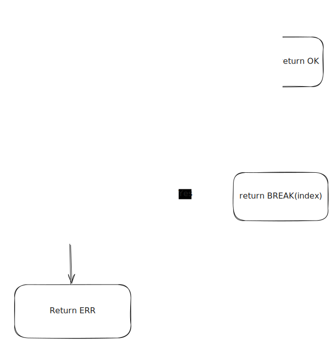
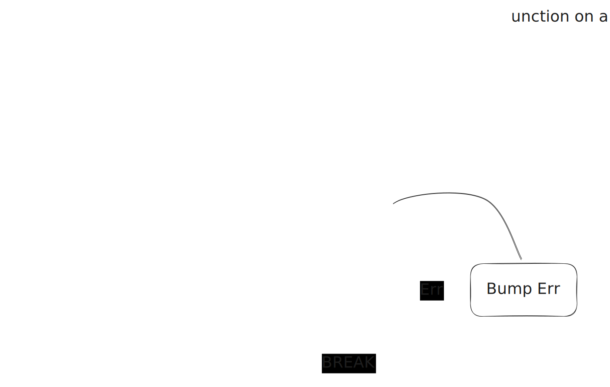
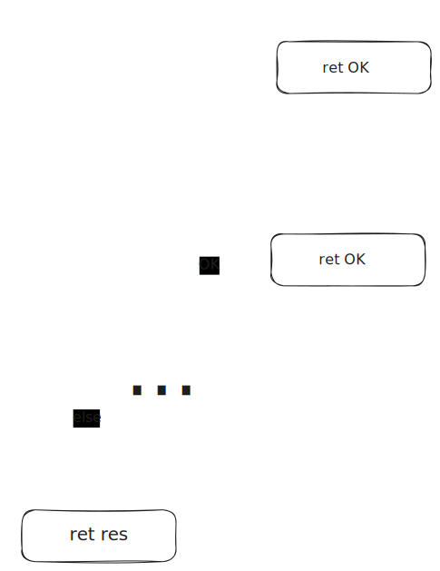
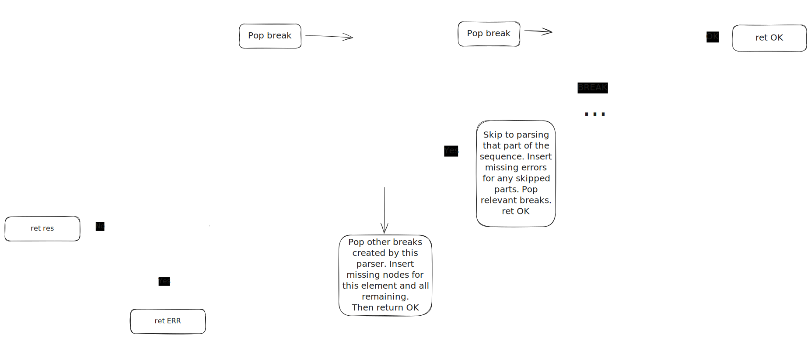
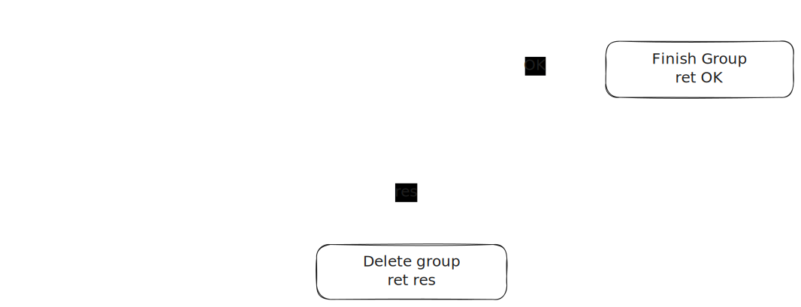
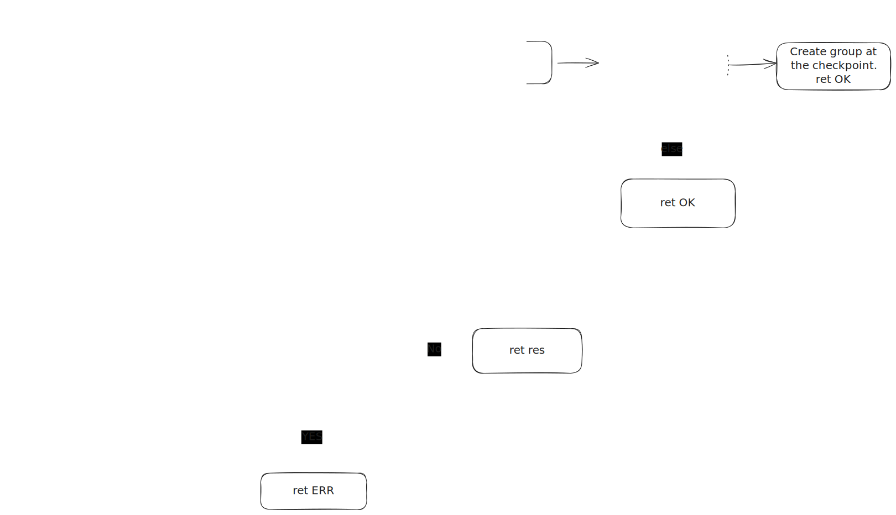

# Architecture & Runtime Model

This document describes the **runtime architecture of the Gibberish parser**. It focuses on how parsing is executed, how state is managed, and how lossless syntax trees (LSTs) and error recovery are implemented.

This is not a language reference; instead, it explains _how_ Gibberish works under the hood, in order to explain how the generated parsers will behave.

> **Note**
> This document reflects the current implementation but is still **evolving**. Terminology and details may change as the parsing model is refined.

---

## Overview

At runtime, Gibberish operates as a collection of cooperating parsers that all mutate a shared `ParserState`. Parsing is **single-pass**, **deterministic**, and **non-backtracking**.

Rather than succeeding or failing outright, parsers recover by hitting `BREAK` boundaries set by parent parsers.

The result of parsing is always a **lossless syntax tree**, even in the presence of severe syntax errors.

---

## Parser State

All parsers operate on a shared mutable `ParserState`.

### State Components

The parser state consists of:

- **Token array**
  The full stream of tokens produced by the lexer.

- **Node stack**
  A stack of partially-constructed `Node`s. The top of the stack is the _current group_.

- **Current offset**
  A `u64` index into the token array.

- **Delimiter stack**
  A stack of delimiter sentinels used to detect recovery boundaries.

- **Skip set**
  A set of token kinds that should be skipped (but still recorded).

> **Implementation note**
> The offset is a `u64`. Arrays are represented as three machine words (pointer, length, capacity), totaling 24 bytes.

---

## Nodes and the Lossless Syntax Tree

The output of parsing is a **lossless syntax tree (LST)**. Every token and structural decision is represented explicitly.

### Node Kinds

Conceptually, a `Node` is an enum with the following variants:

- **Lexeme**
  A successfully parsed token. Contains:

  - token kind
  - span
  - source text

- **Group**
  A syntactic construct (named or unnamed). Contains:

  - group kind
  - ordered list of child nodes

- **Missing**
  Represents a syntactic element that was expected but not found. Contains:

  - list of expected parser or token identifiers

- **Unexpected**
  Represents tokens that could not be parsed at the current position. Contains:

  - list of lexemes

- **Skip**
  A skipped token (e.g. whitespace or comments). Semantically identical to `Lexeme` but marked as skipped.

> **Implementation note**
> Each `Node` occupies 32 bytes.

---

## Core State Operations

Parsers interact with the runtime exclusively through a fixed set of primitive operations.

---

### Token Inspection

#### `Current`

Returns the kind of the current token at the parser offset.

- Used for lookahead and branching
- Used by delimiters to detect recovery boundaries

---

### Token Consumption

#### `Bump`

- Increments the offset
- Converts the current token into a `Lexeme`
- Appends it to the current group

#### `BumpSkipped`

Same as `Bump`, but creates a `Skip` node instead of a `Lexeme`.

#### `BumpError`

- Increments the offset
- Records the token as unexpected

If the last node in the current group is already an `Unexpected` node, the token is appended to it. Otherwise, a new `Unexpected` node is created.

---

### Group Management

#### `EnterGroup(name)`

Pushes a new, empty `Group` node onto the node stack. This group becomes the _current group_.

#### `ExitGroup`

Pops the current group from the stack and appends it to the parent group.

---

### Breaks

#### `PushBreak(parser)`

Pushes a `break` onto the break stack, returns the `break_index`
(the integer value returned if calling `parse` hits this `break`).

#### `PopBreak`

Pops an element of the break stack.

---

### Skipping Tokens

#### `Skip(token_kind)`

Adds a token kind to the skip set.

- Returns whether the token kind was already skipped
- Enables correct restoration in nested contexts

#### `Unskip(token_kind)`

Removes a token kind from the skip set.

Skipped tokens are still consumed and emitted as `Skip` nodes.

---

## Parsers

Parsers in Gibberish can be described by 3 properties and a `parse` function:

### Properties

- Start Tokens: A list of all the tokens it's possible for the parser to start with.
- Expected: A list of expected items which is generated when this parse is missing from a parent.
- Optional: Is the parser optional

### The `parse` function

This function describes how the parser should interact with the `state`
and call child `parse` functions to attempt a parse.

The execution of the parse can be seperated into two parts, committed and uncommitted.
Every parser in Gibberish requires **exactly one** token to match before committing to parsing.
Once the parser has committed it's required that function returns `OK`.
If the parser fails to commit, there are two possible returns:

- `BREAK(index)`: The first token didn't match `OK` but was an item on the break stack.
  The index is used to determine who is responsible to handling break.
- `ERR`: Otherwise

Each `parse` function is required to behave by a set of rules:

1. `parse` may mutate the state, however it's required that the `break_stack` and
   `skip_set` recovered at the end of each `parse`. The parser didn't commit, then the whole state
   should be recovered.
2. Any groups opened should be closed or deleted.
3. A parser should only return a `BREAK` if it was the first token and was added
   to the `break_stack` by a parent, not itself.
4. Anytime a parser calls a child `parse` function and it returns a
   parent `BREAK` it should exit gracefully (without bumping following these rules).

## Breaks

Breaks are the core mechanism used to coordinate recovery between parsers.

Each parser has a set of potential start tokens. For example the start of an sql statment might be 'SELECT', 'UPDATE', 'DELETE'.
A break is a _sentinel_ representing a parser’s **start condition** and just checks if the current token matches one of its start tokens.
When a parser fails to parse a token, it then checks to see if any `break`
in the stack matches the token (in reverse order to how it was added).

- If this token doesn't match any break, then the token is bumped as `Unexpected`, or the parser returns `ERR` if uncommitted.
- Otherwise:
  1. If the `BREAK` was is local to the parser, then it should handle this depending on the parsers behaviour.
     (see diagrams below)
  2. If the `BREAK` occured after the parser committed, then the parser should end gracefully.
     i.e. create errors for nodes which are missing and end opened groups.
  3. If the `BREAK` was the parsers first token, propergate it. Unless it was a local `break`.

Breaks are used to determine whether a parser should _begin_, not to force it to stop once committed.

### Break Stack

- Breaks are pushed by parsers to give child parsers opportunities to recover.
- They can also provide the current parser with infomation,
  like telling a sequence that it should skip to parsing a later part.
- Breaks are removed dynamically as parsing progresses (e.g. in sequences, repeated)

---

## Parser Results

Parsers return an integer value that communicates how outer parsers should proceed.

- **`OK`** (`0`)
  The parser consumed at least one **non-skipped** token. Once a parser commits, it will always return `OK`, even if it later encounters delimiters and must synthesize `Missing` nodes.

- **`ERR`** (`1`)
  The parser failed to parse its first non-skipped token but did not encounter a delimiter. This indicates that the token should generally be consumed as `Unexpected`. In the case of `choice`, `ERR` signals that the next alternative should be tried.

- **`BREAK(index)`** (`>= 2`)
  The parser declined to begin because the **first non-skipped token** matched a delimiter older than the parser.

`BREAK(EOF)` is represented by `2`.

---

## BREAK Semantics

A `BREAK` represents a refusal to start parsing, not a failure during parsing.

When a parser begins execution:

- It has not yet consumed any non-skipped tokens
- It may push delimiters advertising its start tokens

While parsing:

- If the **first non-skipped token** matches an older delimiter, the parser must immediately return that `BREAK`
- If the parser consumes any non-skipped token, it becomes _committed_ and will never return `BREAK`
- After commitment, delimiters are ignored for control flow and only influence error synthesis

This establishes clear ownership rules:

- Parsers may decline to start (`BREAK`)
- Parsers may not abandon work once started

---

## Combinator Diagrams

### Token

### Key

### Choice

### Sequence

### Named

### Fold

---

## Why This Model?

This architecture avoids:

- Global backtracking
- Parsers partially undoing work
- Ambiguous failure vs recovery semantics

In exchange, it provides:

- Deterministic parsing
- Explicit commitment points
- Trees suitable for IDEs, formatters, and analyzers

The complexity is explicit, but controlled.
